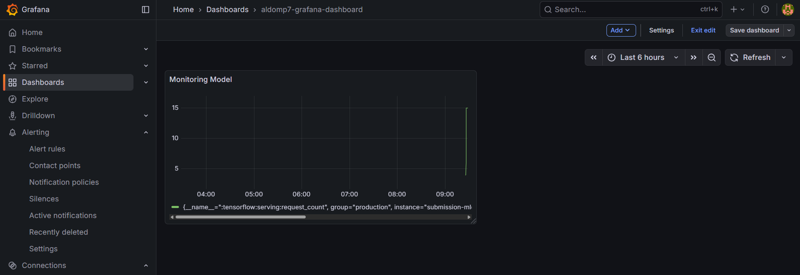

# 🫀 Heart Failure Prediction — End-to-End MLOps


Predicting patient mortality risk from clinical records, built as a **complete machine-learning lifecycle** — from automated data validation all the way to a monitored, containerized prediction service.

This repository is organized in two stages that together tell one story: **(1)** building a reproducible **TFX pipeline**, and **(2)** taking that model to **production** with serving, CI/CD, and observability.

---

## 📌 Problem

Cardiovascular diseases are the leading cause of death worldwide, accounting for roughly **17.9 million deaths a year**. For patients in heart failure, early risk stratification can be the difference between timely intervention and a missed window. The goal here is an automated system that predicts the risk of a fatal event (`DEATH_EVENT`) from routinely collected clinical features, so care teams can prioritize high-risk patients.

## 📊 Dataset

[**Heart Failure Clinical Records**](https://www.kaggle.com/andrewmvd/heart-failure-clinical-data) — 299 patient records, 12 predictor features + 1 binary target.

| Type | Features |
|---|---|
| **Numerical (7)** | `age`, `creatinine_phosphokinase`, `ejection_fraction`, `platelets`, `serum_creatinine`, `serum_sodium`, `time` |
| **Categorical (5)** | `anaemia`, `diabetes`, `high_blood_pressure`, `sex`, `smoking` |

---

## 🏗️ Architecture

### Stage 1 — TFX Pipeline (`01-pipeline/`)

A reproducible pipeline covering the full lifecycle, where each component hands a validated artifact to the next:

```
CsvExampleGen → StatisticsGen → SchemaGen → ExampleValidator
      → Transform → Tuner → Trainer → Evaluator → Pusher
```

- **Data validation** — `StatisticsGen`, `SchemaGen`, `ExampleValidator` detect anomalies and schema drift before training.
- **Preprocessing** — `Transform` with TensorFlow Transform (TFT): numerical features standardized via **Z-score**, categorical features kept as `int64`.
- **Hyperparameter tuning** — `Tuner` (KerasTuner) searches the model space automatically.
- **Model** — a **Deep Neural Network** (Keras Functional API): tunable dense + dropout layers → `64 → 32` hidden units → sigmoid output for binary classification, Adam optimizer.
- **Gated deployment** — `Evaluator` only "blesses" a model if it beats both an absolute threshold and the previous baseline; `Pusher` exports the blessed `SavedModel`.

### Stage 2 — MLOps Deployment (`02-mlops-deployment/`)

The blessed model is promoted to a production-style service:

- **Serving** — **TensorFlow Serving** inside a **Docker** container, exposing a REST API.
- **CI/CD** — deployed on **Railway**, integrated with GitHub for automatic redeploys on every push.
- **Monitoring** — **Prometheus** scrapes serving metrics (e.g. `:tensorflow:serving:request_count`); **Grafana** visualizes request volume, latency, and model-prediction activity in real time.

---

## 📈 Results

| Stage | Status | Validation Accuracy |
|---|---|---|
| Pipeline (Stage 1) | ✅ **BLESSED** | **82.22%** |
| MLOps model (Stage 2) | ✅ **BLESSED** | **81.11%** |

Both models cleared the evaluation gate (beating the baseline and the absolute threshold) and were exported as a `SavedModel` with a `serving_default` signature.

<p align="center">
  
  <br><i>Real-time serving metrics in Grafana — request volume rises as the test client fires predictions, then plateaus.</i>
</p>

---

## 🛠️ Tech Stack

`TensorFlow` · `TFX` · `TensorFlow Transform` · `KerasTuner` · `TensorFlow Serving` · `Docker` · `Railway` · `Prometheus` · `Grafana` · `Pandas`

---

## 📂 Repository Structure

```
heart-failure-prediction-mlops/
├── 01-pipeline/                  # Stage 1: TFX training pipeline
│   ├── notebook.ipynb            # Pipeline walkthrough & analysis
│   ├── modules/                  # Transform, Trainer, Tuner components
│   ├── data/                     # Clinical records (CSV)
│   └── docs/                     # Pipeline diagrams & metadata
├── 02-mlops-deployment/          # Stage 2: serving + monitoring
│   ├── notebook.ipynb            # Deployment walkthrough
│   ├── modules/                  # Pipeline components
│   ├── monitoring/               # Prometheus config + exporter
│   ├── Dockerfile                # TF Serving container
│   ├── tf_serving_entrypoint.sh
│   └── docs/                     # Deployment, Grafana, monitoring screenshots
├── requirements.txt
├── .gitignore
└── README.md
```

> **Note:** Large generated artifacts (full TFX metadata stores, intermediate pipeline outputs, and serialized `SavedModel` binaries) are intentionally excluded via `.gitignore`. Run the notebooks to regenerate them locally.

---

## ▶️ How to Run

```bash
# 1. Clone
git clone https://github.com/AllsHub/heart-failure-prediction-mlops.git
cd heart-failure-prediction-mlops

# 2. Install dependencies
pip install -r requirements.txt

# 3. Stage 1 — run the TFX pipeline
#    Open 01-pipeline/notebook.ipynb and run all cells

# 4. Stage 2 — serve the model with Docker
cd 02-mlops-deployment
docker build -t heart-failure-serving .
docker run -p 8501:8501 heart-failure-serving
```

---

## 👤 Author

**Aldo Maretra Putra**
Astronomy student & ML practitioner
📧 aldomaretraputra7@gmail.com · 🤗 [aldomrtr](https://huggingface.co/aldomrtr)

> Originally developed for Dicoding's *Machine Learning Operations (MLOps)* learning path, then restructured and documented for this portfolio.
